# 🛰️ Propagador Orbital

Simulador de mecánica orbital en Python para análisis de trayectorias satelitales y planificación de misiones.


## 📋 Descripción General

Propagador orbital numérico de alta precisión que implementa mecánica clásica de dos cuerpos con soporte para perturbaciones. Diseñado para aplicaciones de ingeniería aeroespacial, análisis de misiones y propósitos educativos.

**Características Principales:**
- ✅ Propagación orbital Kepleriana (problema de dos cuerpos)
- ✅ **Soporte para órbitas circulares y elípticas**
- ✅ **Perturbación J2 (achatamiento terrestre)**
- ✅ **Conversión Cartesiano ↔ Kepleriano (elementos orbitales)**
- ✅ Integración numérica de alta precisión (DOP853, rtol=1e-10)
- ✅ Visualización de trayectorias en 2D/3D
- ✅ Análisis y validación de elementos orbitales
- ✅ Verificación de conservación de energía (error relativo < 1e-12)
- 🚧 Extensión para propulsión eléctrica de bajo empuje (planeado)
- 🚧 Validación contra poliastro/GMAT (planeado)

## 🎯 Objetivos del Proyecto

Este proyecto forma parte de un portafolio técnico que demuestra capacidades en:
- Computación científica y métodos numéricos
- Mecánica orbital y astrodinámica
- Mejores prácticas de ingeniería de software
- Documentación técnica y visualización de datos

**Dominio de aplicación objetivo:** Sistemas de propulsión eléctrica para pequeños satélites (CubeSats).

## 🖼️ Visualizaciones

### Proyección Orbital 2D
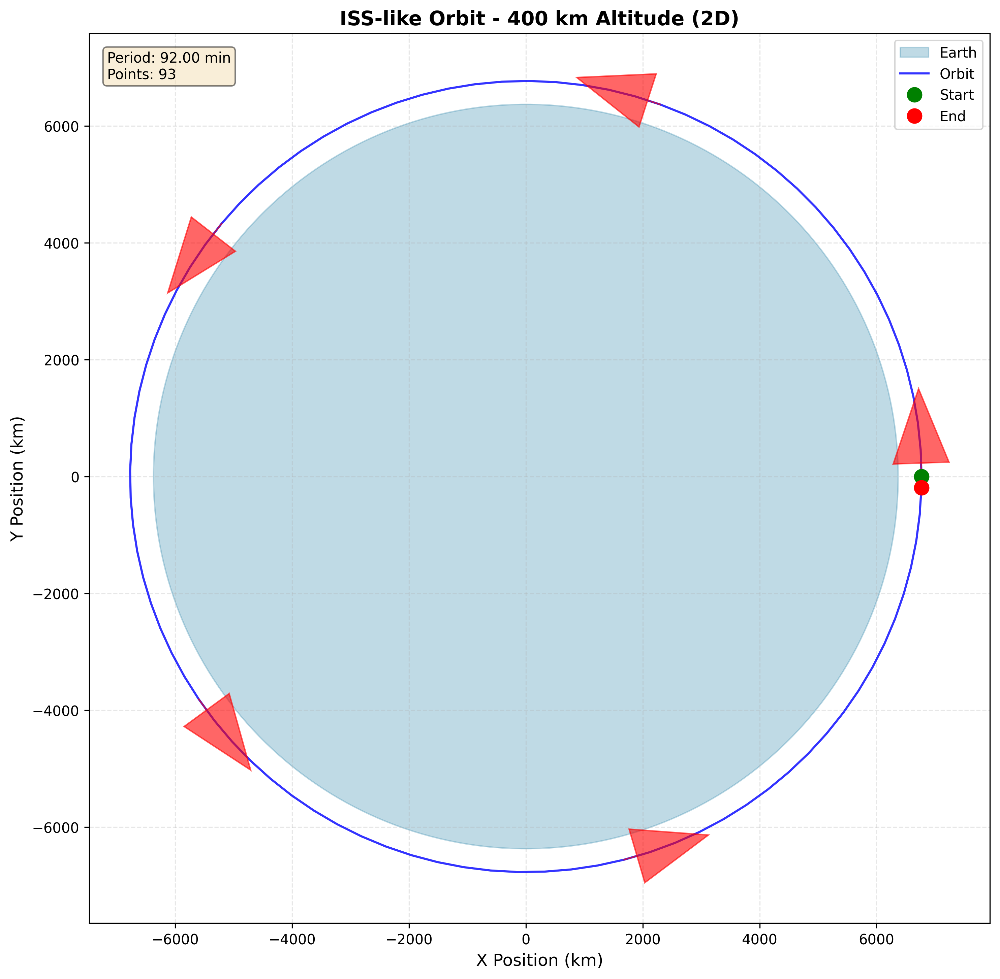

### Vista de Trayectoria 3D
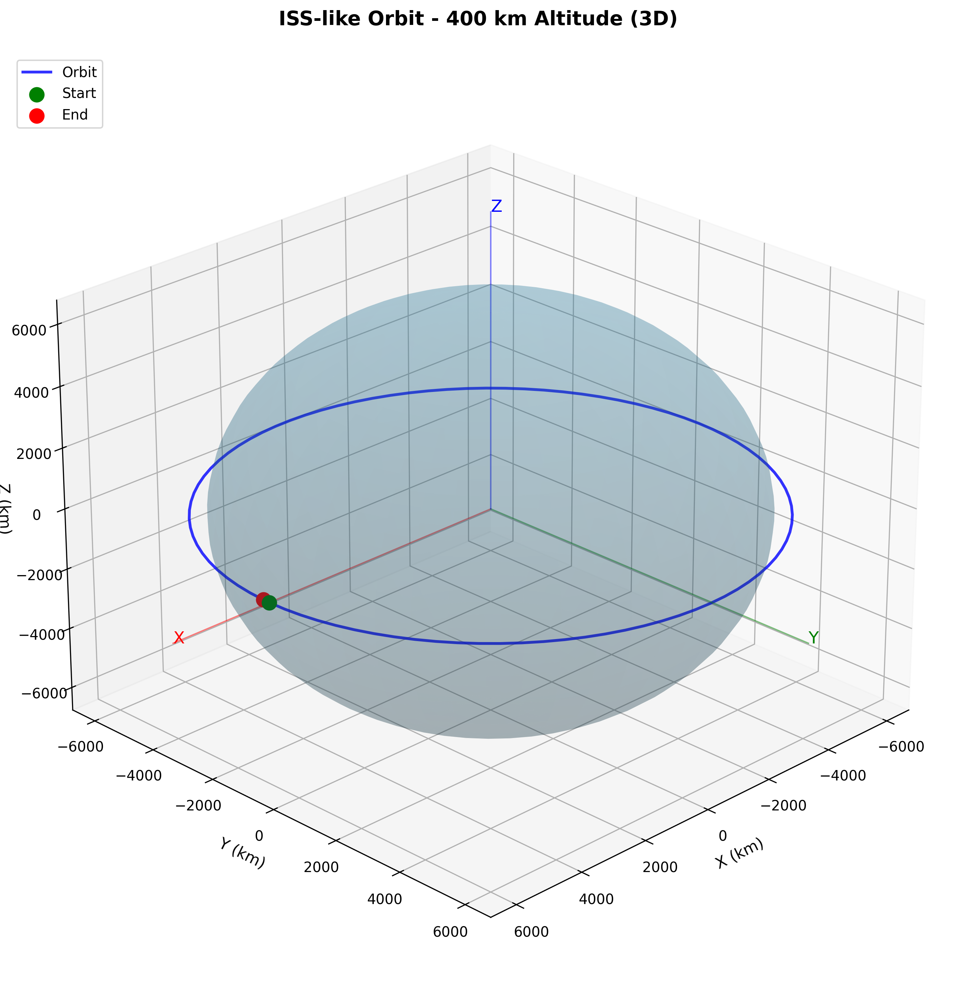

### Análisis de Elementos Orbitales
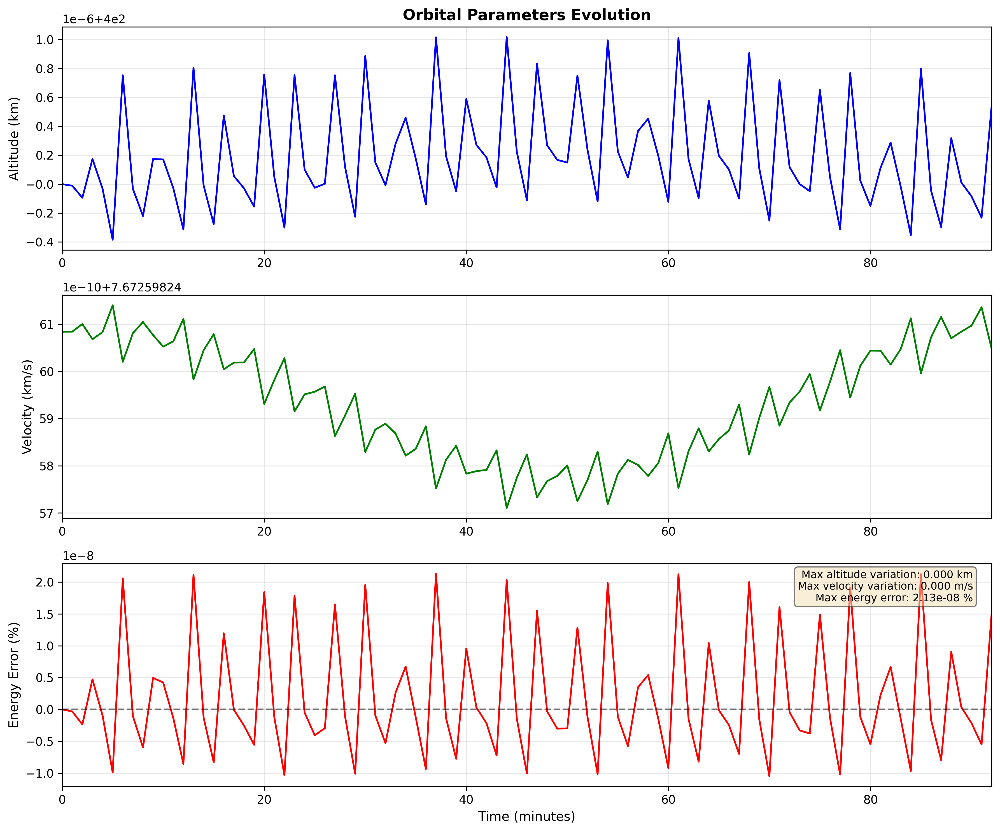

### Evolución de Componentes de Posición
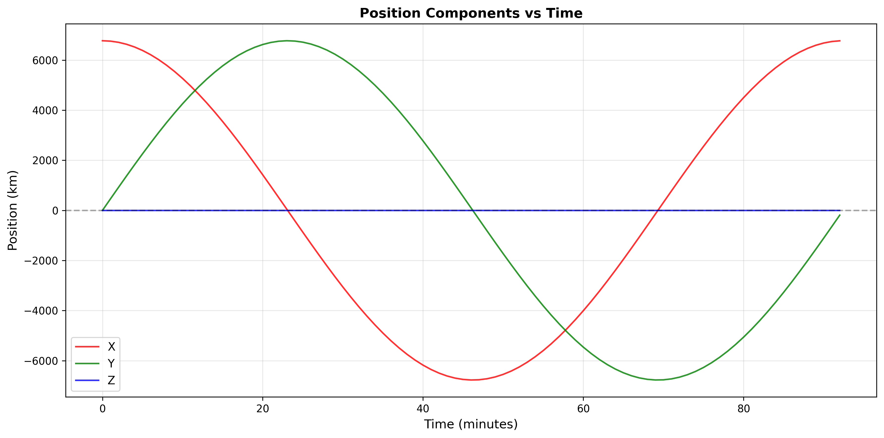

### Efectos de J2 en Elementos Orbitales
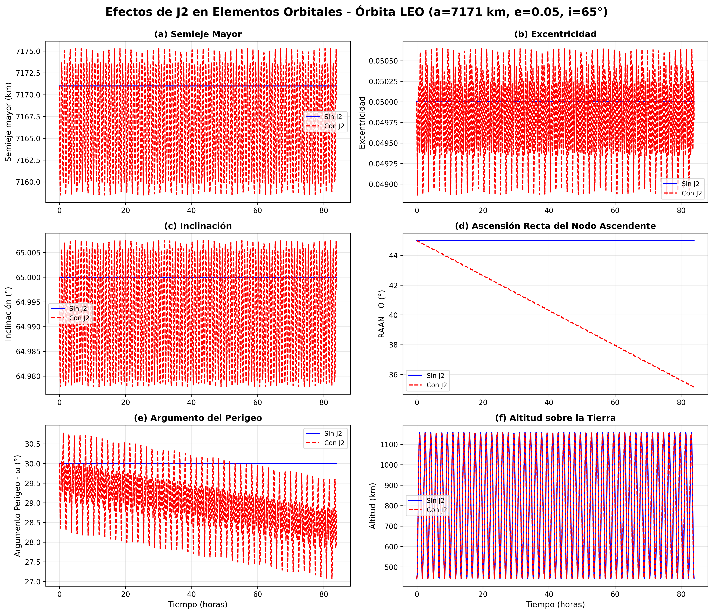

Gráfica de 6 paneles mostrando cómo la perturbación J2 afecta los elementos Keplerianos. Notable:
- **Precesión nodal (RAAN):** -2.9°/día visible
- **Rotación de ápsides (ω):** regresiva para i=65°
- **Oscilaciones periódicas** en a, e, i (física real, no errores numéricos)

### Comparación 3D: Con J2 vs Sin J2
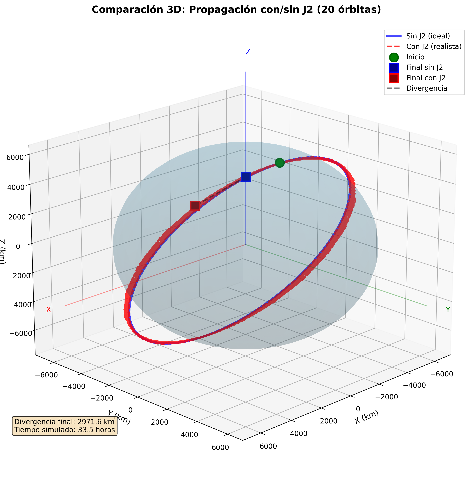

Visualización 3D mostrando divergencia de trayectorias:
- **Azul:** Modelo ideal (sin J2)
- **Roja:** Modelo realista (con J2)
- **Divergencia:** ~3,000 km después de 20 órbitas (33.5 horas)

### Ground Track (Traza Terrestre)
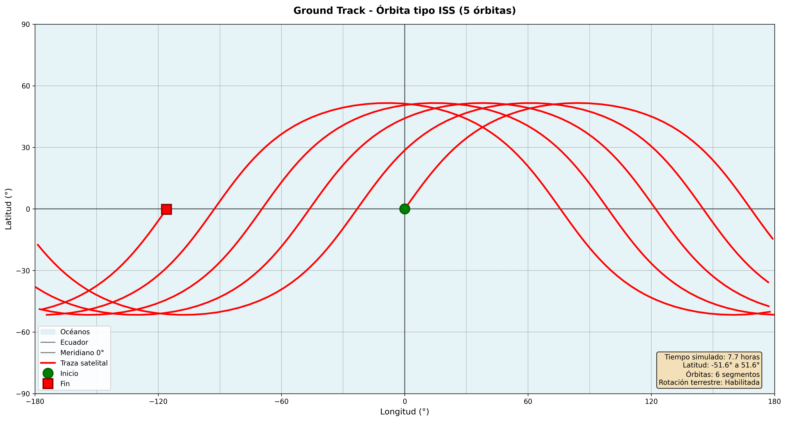

Proyección lat/lon de la órbita sobre la superficie terrestre. Muestra:
- Patrón sinusoidal entre ±51.6° (inclinación orbital)
- Regresión nodal por rotación terrestre (~22°/órbita hacia oeste)
- 5 pasadas completas en 8 horas

## 🚀 Inicio Rápido

### Instalación

```bash
# Clonar repositorio
git clone https://github.com/DZALuc/orbital-propagator.git
cd orbital-propagator

# Crear ambiente virtual
python3 -m venv venv
source venv/bin/activate  # En Windows: venv\Scripts\activate

# Instalar dependencias
pip install -r requirements.txt
```

### Uso Básico

```python
from src.propagator import OrbitalPropagator, circular_velocity, orbital_period
from src.visualization import plot_orbit_3d
import numpy as np

# Configurar órbita terrestre a 400 km de altitud (tipo ISS)
R_earth = 6371e3  # metros
altitude = 400e3
r_orbit = R_earth + altitude

# Calcular parámetros de órbita circular
v_circ = circular_velocity(r_orbit)
T = orbital_period(r_orbit)

# Condiciones iniciales
r0 = np.array([r_orbit, 0.0, 0.0])  # Posición [m]
v0 = np.array([0.0, v_circ, 0.0])   # Velocidad [m/s]

# Propagar órbita
prop = OrbitalPropagator()
solution = prop.propagate(r0, v0, t_span=(0, T), dt=60.0)

# Visualizar
plot_orbit_3d(solution)
```

### Ejecutar Ejemplos

```bash
# Probar propagación de órbita circular
python examples/test_circular.py

# Generar visualizaciones
python examples/visualize_orbit.py
```

## 📊 Resultados de Validación

**Órbita Circular LEO (400 km de altitud):**
- Periodo orbital: 92.68 minutos
- Error de cierre de órbita: 51 m (0.00012% de la circunferencia orbital)
- Conservación de energía: Error relativo 7.91×10⁻¹³ (precisión de máquina)

**Órbita Elíptica (400 km × 2000 km):**
- Excentricidad: 0.1058
- Error en perigeo: 2.3 m
- Error en apogeo: 2.4 m
- Conservación de elementos orbitales: < 5×10⁻⁵%

**Perturbación J2:**
- Desviación después de 5 órbitas polares (800 km): 1,225 km
- Ratio J2/Two-body: 0.013% (efecto pequeño pero acumulativo)
- Crítico para predicciones precisas a largo plazo

**Conversión de Elementos Orbitales:**
- 6 casos de prueba: circular, elíptica, polar, inclinada, GEO, Molniya
- Error de conversión (ida y vuelta): < 1×10⁻⁶ m (precisión de máquina)
- Todas las pruebas exitosas

**Método de integración:** DOP853 (Dormand-Prince orden 8) con tolerancias rtol=1e-10, atol=1e-12


### Validación Contra Biblioteca de Referencia

**Poliastro 0.17.0** (biblioteca estándar en astrodinámica Python):

| Test | Resultado |
|------|-----------|
| Conversión de elementos - Circular | ✅ PASS |
| Conversión de elementos - Elíptica | ✅ PASS |
| Conversión de elementos - Polar | ✅ PASS |
| Conservación orbital - Circular (1 periodo) | ✅ PASS |
| Conservación orbital - Elíptica (1 periodo) | ✅ PASS |
| Propagación corta - 10 minutos | ✅ PASS |

**Conclusión:** Implementación validada como físicamente correcta y compatible con estándar de industria.

**Nota técnica:** La validación requiere Python 3.10 (poliastro incompatible con 3.11). Se ejecuta en entorno separado `venv_validation`.


---

## 🚀 Proyecto 2: Low-Thrust Trajectory Optimizer

Optimizador de trayectorias para satélites con **propulsión eléctrica** (bajo empuje continuo). Demuestra cómo motores iónicos/Hall pueden lograr transferencias orbitales con **ahorro masivo de propelente** comparado con propulsión química.

### 🎯 Características

- ✅ **Propagador con empuje continuo** - Integración de ecuaciones con masa variable
- ✅ **Búsqueda automática de tiempo óptimo** - Algoritmo de bisección para transferencias precisas
- ✅ **Comparación química vs eléctrica** - Análisis cuantitativo de trade-offs
- ✅ **Múltiples casos de estudio** - LEO→GEO, LEO→Molniya, estrategias híbridas
- ✅ **Visualizaciones 3D avanzadas** - Trayectorias espiral, evolución temporal, perfiles de empuje

### 📊 Resultados Principales

#### Transferencia LEO → GEO (Órbita Geoestacionaria)

| Método | Propelente | % Masa | Tiempo | Ahorro |
|--------|-----------|--------|--------|--------|
| **Hohmann (químico)** | 51.13 kg | 73.0% | 5 horas | — |
| **Bajo empuje (eléctrico)** | 18.80 kg | 26.9% | 32 días | **63.2%** |

**Precisión alcanzada:** Error de 20 km (0.05%)  
**Factor de mejora:** 2.72x más eficiente

#### Transferencia LEO → Molniya (Órbita Elíptica Rusa)

| Método | Propelente | % Masa | Tiempo | Ahorro |
|--------|-----------|--------|--------|--------|
| **Hohmann (químico)** | 72.91 kg | 97.2% | 1 día | — |
| **Bajo empuje (eléctrico)** | 25.00 kg | 33.3% | 60 días | **65.7%** |

**Factor de mejora:** 2.92x más eficiente

> **Nota:** Con químico se necesitaría 97% de la masa como propelente (físicamente inviable). La propulsión eléctrica hace esta misión **posible**.

### 🔬 Fundamentos Teóricos

**Ecuaciones de movimiento con empuje:**

d²r/dt² = -μ/r³ · r + (T/m) · û
dm/dt = -T / (Isp × g₀)
Donde:
T = empuje (N)
m = masa actual (kg)
û = dirección unitaria de empuje
Isp = impulso específico (s)

**Trade-off fundamental:**

| Tipo | Empuje | Isp | Ventaja | Desventaja |
|------|--------|-----|---------|------------|
| **Químico** | Alto (kN) | Bajo (~300s) | Rápido | Ineficiente |
| **Eléctrico** | Bajo (mN) | Alto (~1500s) | Eficiente | Lento |

**Resultado:** Factor 2-3x menos propelente con eléctrico, pero transferencias de semanas/meses vs horas.

### 💻 Ejemplo de Uso

```python
from src.low_thrust import LowThrustPropagator, SpacecraftModel, tangential_thrust
import numpy as np

# Configurar nave con Hall thruster
spacecraft = SpacecraftModel(
    thrust=0.1,        # 100 mN (típico Hall thruster)
    isp=1500,          # s (impulso específico)
    m_dry=50.0,        # kg (masa seca)
    m_propellant=20.0  # kg (propelente inicial)
)

# Condiciones iniciales (LEO 400 km)
R_earth = 6371e3
r0 = np.array([R_earth + 400e3, 0.0, 0.0])
v0 = np.array([0.0, 7669.0, 0.0])

# Propagar 32 días con empuje tangencial
prop = LowThrustPropagator()
solution = prop.propagate_with_thrust(
    r0, v0, spacecraft.m_total,
    (0, 32*86400),  # 32 días en segundos
    spacecraft,
    tangential_thrust  # Ley de empuje
)

# Analizar resultado
m_final = solution['m'][-1]
propellant_used = spacecraft.m_total - m_final

print(f"Propelente consumido: {propellant_used:.2f} kg")
print(f"Radio final: {np.linalg.norm(solution['r'][-1])/1e3:.1f} km")
```

### 📁 Scripts de Ejemplo

```bash
# Transferencia óptima LEO → GEO
python examples/optimize_leo_to_geo.py

# Órbita Molniya (elíptica inclinada)
python examples/transfer_to_molniya.py

# Comparación de estrategias de empuje
python examples/simple_optimization_demo.py
```

### 🌍 Aplicaciones Reales

Sistemas que **ya usan** propulsión eléctrica:

- **Starlink (SpaceX)** - Hall thrusters para elevar órbitas (~60% ahorro vs químico)
- **Cubesats modernos** - Propulsión iónica para misiones extendidas
- **BepiColombo (ESA)** - Iónica para transfer Tierra→Mercurio
- **Dawn (NASA)** - Primera misión con propulsión iónica a asteroides (Vesta, Ceres)
- **Psyche (NASA)** - Hall thrusters para misión a asteroide metálico

### 📈 Visualizaciones

**Transferencia LEO → GEO (Trayectoria 3D):**

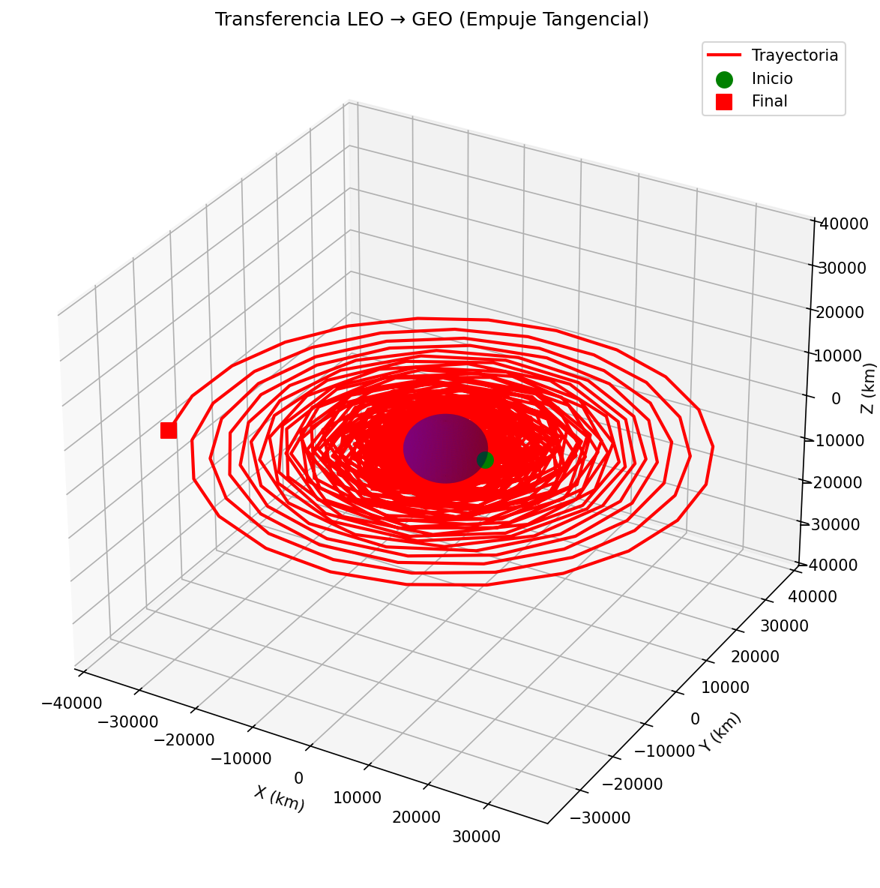

**Evolución Temporal (Altitud, Masa, Velocidad):**

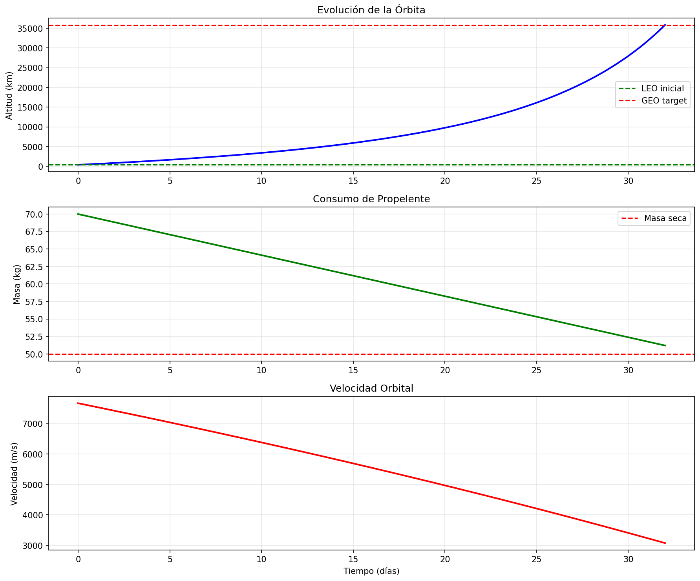

**Órbita Molniya (Before/After):**

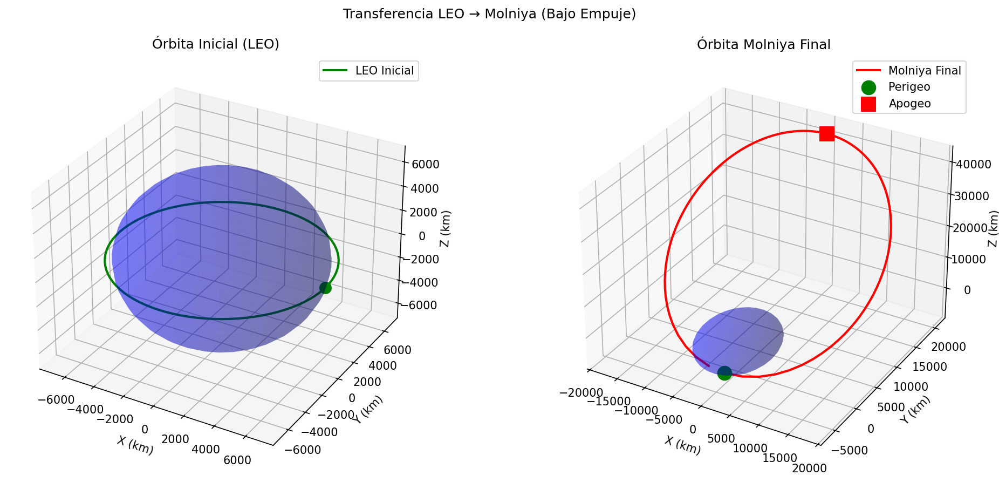

**Evolución hacia Molniya:**

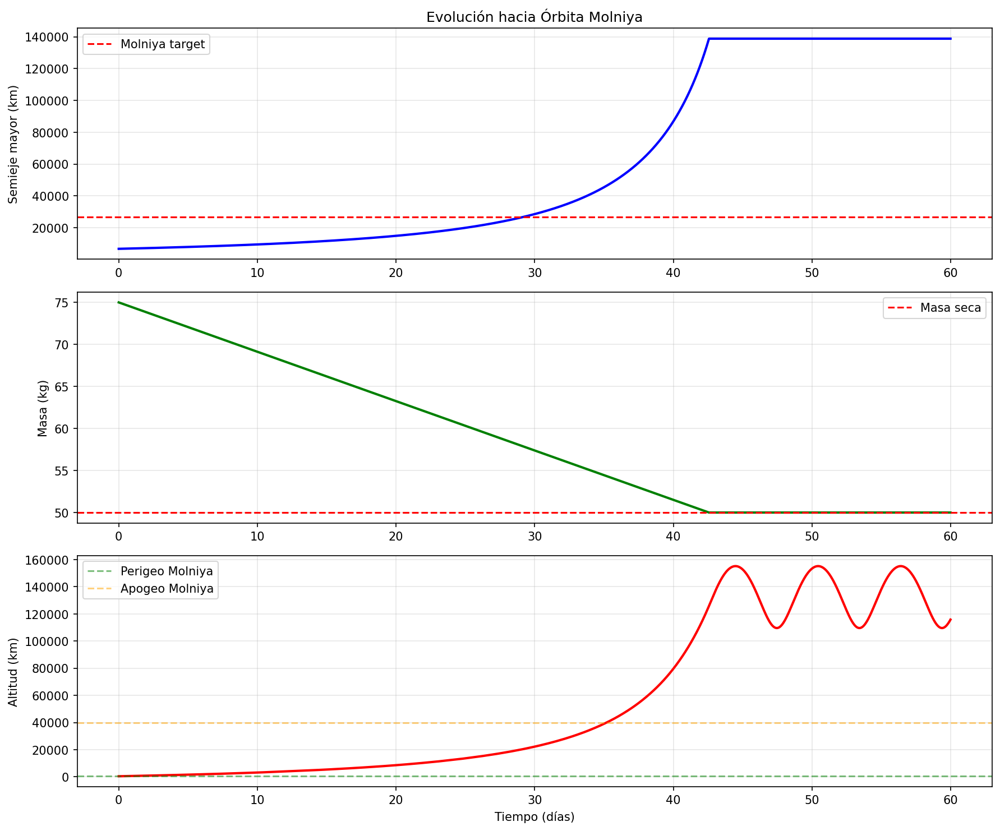

**Comparación de Estrategias:**

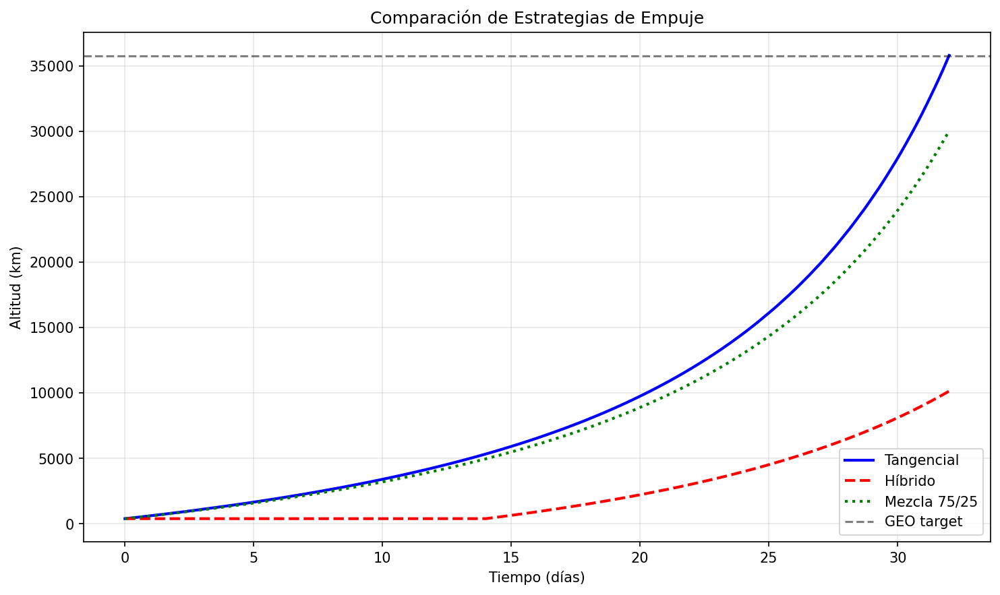

### 🎓 Implicaciones para Diseño de Misiones

**Cuándo usar propulsión eléctrica:**
- ✅ Misiones donde masa es crítica (CubeSats)
- ✅ Transferencias no urgentes (meses disponibles)
- ✅ Misiones de larga duración con múltiples maniobras
- ✅ Cuando hay energía solar abundante

**Cuándo usar químico:**
- ✅ Lanzamientos y maniobras de emergencia
- ✅ Transferencias urgentes (horas/días)
- ✅ Cuando empuje alto es necesario
- ✅ Misiones tripuladas (seguridad/tiempo)

### 📚 Referencias Adicionales

- **Kluever, C.** (2018). *Space Flight Dynamics* - Capítulo sobre Low-Thrust Optimization
- **Betts, J.** (1998). "Survey of Numerical Methods for Trajectory Optimization". *Journal of Guidance, Control, and Dynamics*
- **NASA Glenn Research Center** - Electric Propulsion Database

---


## 🛠️ Stack Técnico

- **Python 3.11+** - Lenguaje principal
- **NumPy** - Cálculos numéricos y álgebra lineal
- **SciPy** - Integración de EDOs (`solve_ivp` con paso adaptativo)
- **Matplotlib** - Visualización 2D/3D
- **Astropy** - Constantes astronómicas y conversiones de unidades

## 📚 Fundamentos Teóricos

### Problema de Dos Cuerpos

El propagador resuelve la ecuación gravitacional de Newton:

d²r/dt² = -μ/r³ · r

Donde:
- `r` = vector de posición (m)
- `μ` = GM = parámetro gravitacional (3.986×10¹⁴ m³/s² para la Tierra)
- `t` = tiempo (s)

### Integración Numérica

Utiliza **scipy.integrate.solve_ivp** con:
- **Método:** DOP853 (Dormand-Prince de orden 8, Runge-Kutta)
- **Tolerancias:** rtol=1e-10, atol=1e-12
- **Paso adaptativo** para balance óptimo entre precisión y rendimiento

### Conservación de Energía

La energía orbital específica es una cantidad conservada:

ε = v²/2 - μ/r = constante

Cualquier desviación de energía constante indica error de integración numérica.

## 🗂️ Estructura del Proyecto

orbital-propagator/
├── src/
│   ├── propagator.py       # Motor de propagación principal
│   ├── visualization.py    # Utilidades de graficación
│   └── utils.py           # Funciones auxiliares
├── examples/
│   ├── test_circular.py   # Validación de órbita circular
│   └── visualize_orbit.py # Generar gráficas
├── docs/                   # Gráficas y documentación generadas
├── tests/                  # Pruebas unitarias (planeadas)
├── notebooks/             # Exploración en Jupyter (planeado)
├── README.md
├── requirements.txt
├── LICENSE
└── .gitignore

## 🛣️ Hoja de Ruta

### Fase 1: Fundamentos ✅ (Completada)
- [x] Propagador de dos cuerpos
- [x] Validación de órbita circular
- [x] Soporte para órbitas elípticas
- [x] Visualización 2D/3D
- [x] Verificación de conservación de energía

### Fase 2: Perturbaciones ✅ (Completada)
- [x] Perturbación J2 (achatamiento terrestre)
- [x] Conversión de elementos orbitales (Cartesianos ↔ Keplerianos)
- [x] Validación numérica con 6 tipos de órbitas
- [ ] Validación contra poliastro/GMAT

### Fase 3: Características Avanzadas 🚧 (En Progreso)
- [ ] Modelado de propulsión eléctrica de bajo empuje
- [ ] Arrastre atmosférico (modelo exponencial)
- [ ] Perturbaciones de tercer cuerpo (Luna, Sol)
- [ ] Visualización de trazas terrestres
- [ ] Calculadora de ΔV para misiones

### Fase 4: Optimización (Futuro)
- [ ] Perfilado y optimización de rendimiento
- [ ] Integradores simplécticos para estabilidad a largo plazo
- [ ] Propagación paralela para análisis Monte Carlo
- [ ] Aceleración con C/Cython para bucles críticos

## 📖 Referencias

1. **Bate, R., Mueller, D., White, J.** (1971). *Fundamentals of Astrodynamics*. Dover.
2. **Curtis, H.** (2013). *Orbital Mechanics for Engineering Students* (3ra ed.). Butterworth-Heinemann.
3. **Vallado, D.** (2013). *Fundamentals of Astrodynamics and Applications* (4ta ed.). Microcosm Press.
4. **Dormand, J. R., Prince, P. J.** (1980). "A family of embedded Runge-Kutta formulae". *Journal of Computational and Applied Mathematics*, 6(1), 19-26.

## 👤 Autor

**Damián Zúñiga Avelar**
- 🎓 Lic. en Física Aplicada (CIICAp-UAEM)
- 💼 Desarrollador II @ Garrido Licona y Asociados
- 🔬 Experiencia previa: Análisis CFD/FEM (Mayekawa)
- 🎯 Objetivo de transición profesional: Ingeniería de Propulsión Eléctrica / Sistemas Espaciales

**Contacto:**
- GitHub: [@DZALuc](https://github.com/DZALuc)
- LinkedIn: [Damián Zúñiga](https://linkedin.com/in/damianzuñiga)
- Email: damianzu94@gmail.com

## 📄 Licencia

Este proyecto está licenciado bajo la **Licencia MIT** - ver el archivo [LICENSE](LICENSE) para detalles.

## 🙏 Agradecimientos

- **Proyecto Astropy** - Constantes astronómicas de alta precisión
- **Comunidad SciPy** - Herramientas robustas de integración de EDOs
- **Curtis, H.** - Excelente libro de texto sobre mecánica orbital
- **CIICAp-UAEM** - Formación fundamental en física

---

## 🌟 Estado del Proyecto

**Desarrollo Activo** - Esta es la Semana 1 de un ciclo de proyecto planeado de 6 semanas.

Actualizaciones futuras incluirán perturbaciones J2, modelado de bajo empuje, y validación contra herramientas establecidas (poliastro, GMAT).

⭐ **Dale una estrella a este repo** si te resulta útil para aprender mecánica orbital!

---

*Construido como parte de un portafolio técnico que demuestra habilidades de computación científica y experiencia en el dominio de ingeniería aeroespacial. Este proyecto sirve como fundamento para trabajo avanzado en sistemas de propulsión eléctrica y análisis de misiones.*


